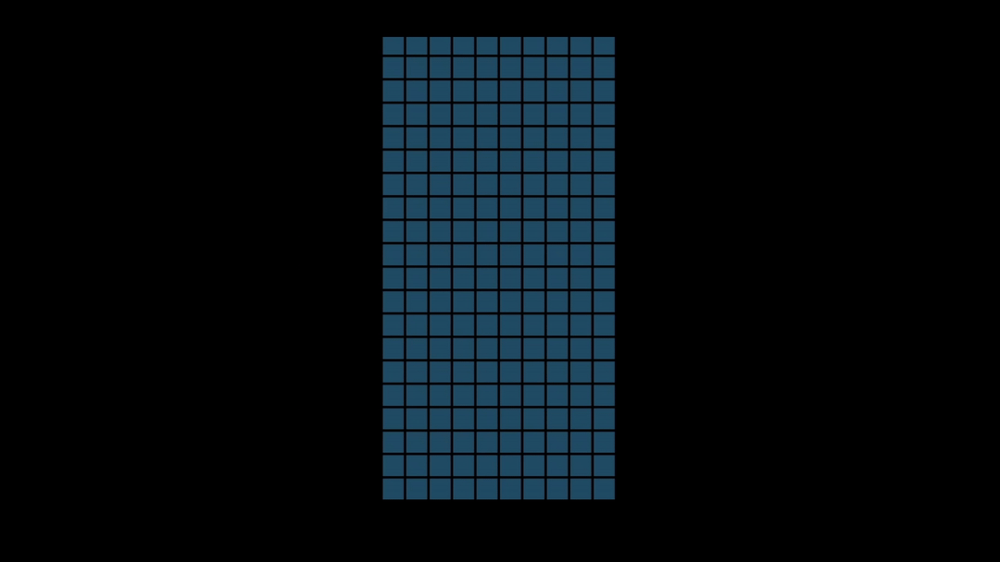

# Tetris Game



[Check it out!](https://whoopalla.github.io/tetris/ "Tetris deployed on github pages")

## How to build

To build the game you will need a C compiler (gcc will do)
```bash
gcc ./nob.c -o ./nob
./nob
```
